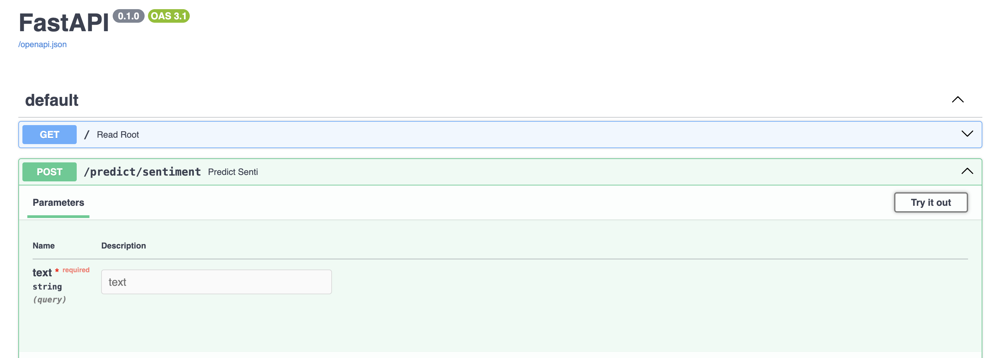
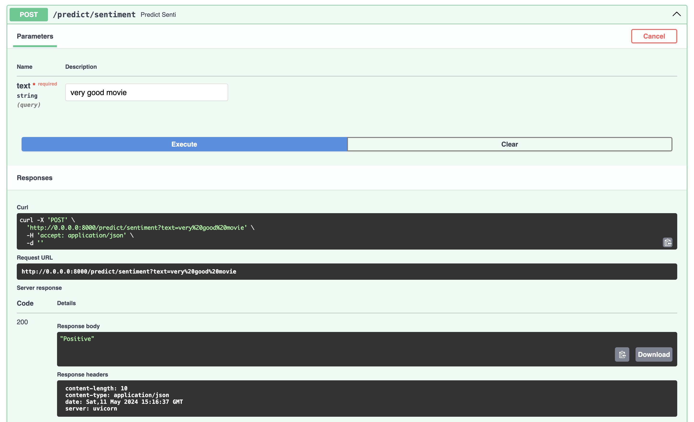

# prediction-harbour
ml-prediction-service

Clone this git repo.

Install 
```shell
pip install textblob
pip install fastapi
```

From the project root directory (prediction-harbour) run below command to boot-up the service.
```shell
fastapi run main.py
```

To verify the service go to http://0.0.0.0:8000/docs and click "Try it out" button under post: /predict_sentiment


Key in some statements that reflect sentiment in text box and hit execute button, you will find the sentiment response.


Alternatively you could try using curl from your terminal or test using postman!
